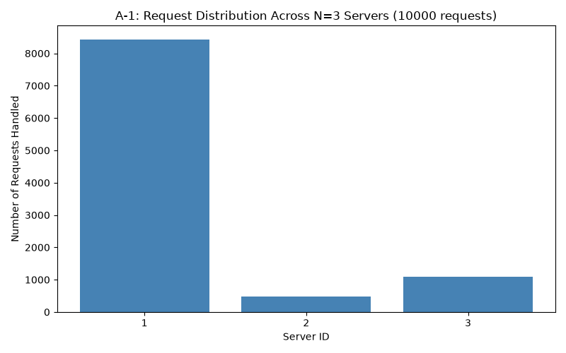
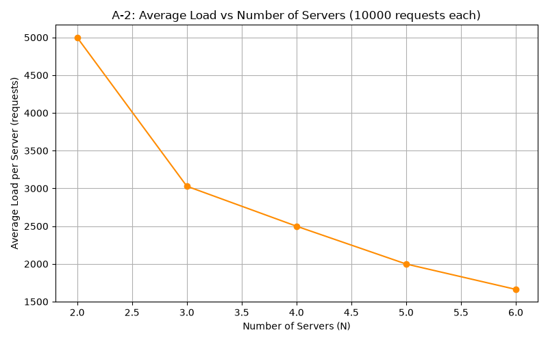

# ICS 4104 — Assignment 1: Customizable Load Balancer

## Overview

This project implements a customizable load balancer that distributes client
requests across multiple backend server replicas using a consistent hashing
algorithm. The system is fully containerized with Docker, and the load
balancer dynamically manages the lifecycle of its backend replicas —
including automatic failure detection and recovery.

## Architecture

- **Server** (`server/`): A minimal Flask web server exposing `/home` and
  `/heartbeat` endpoints. Each replica is identified by a `SERVER_ID`
  environment variable.
- **Consistent Hashing** (`loadbalancer/consistent_hash.py`): A hash-ring
  data structure with 512 slots, using virtual servers (K=9 per physical
  server) and linear probing to resolve slot collisions.
- **Load Balancer** (`loadbalancer/app.py`): A Flask application that:
  - Routes incoming requests to backend replicas via consistent hashing
  - Exposes `/rep`, `/add`, `/rm` endpoints to manage replicas
  - Dynamically spawns and removes real Docker containers using the
    Docker SDK (via a mounted Docker socket)
  - Runs a background thread that polls each replica's `/heartbeat` every
    5 seconds, automatically replacing any replica that fails to respond

## Design Choices

- **Language**: Python (Flask), as recommended by the assignment.
- **Dynamic container management**: Rather than statically defining a fixed
  set of server containers in `docker-compose.yml`, the load balancer
  container itself spawns and destroys server containers using the Docker
  Engine API (via the `docker` Python SDK). This required mounting the host's
  Docker socket (`/var/run/docker.sock`) into the load balancer container
  and running it in `privileged` mode, as described in the assignment's
  appendix.
- **Collision handling**: Linear probing was used for the consistent hash
  map, since it is simple to reason about and sufficient at this scale
  (512 slots, at most a handful of servers).
- **Request IDs**: Since real client requests don't carry a numeric ID, the
  load balancer generates a simple incrementing integer ID per request,
  used purely as input to the hash function `H(i)`.

## Assumptions

- The default configuration always starts with N=3 replicas, matching the
  assignment's default parameters (512 slots, K=9 virtual servers).
- `/add` and `/rm` accept an optional list of preferred hostnames; any
  shortfall is filled with randomly generated hostnames, per the
  assignment's specification.
- The heartbeat monitor checks every 5 seconds; a single failed check is
  treated as a failure (no retry/grace period), prioritizing fast recovery
  over tolerance of transient network blips.

## Testing & Results (Task 4 Analysis)

### A-1: Request Distribution at N=3 (10,000 requests)

Using the assignment's default hash functions
(`H(i) = i² + 2i + 17`, `Φ(i,j) = i² + j² + 2j + 25`):

| Server | Requests Handled | % of Total |
|--------|------------------|------------|
| 1      | 8436             | 84.4%      |
| 2      | 471              | 4.7%       |
| 3      | 1093             | 10.9%      |

**Observation**: The distribution is heavily skewed toward Server 1. This
is because the request IDs used (sequential integers) are not uniformly
scattered by the quadratic hash function `H(i) = i² + 2i + 17` — for
increasing sequential inputs, outputs land disproportionately within
certain ranges of the 512-slot circle, favoring whichever server's virtual
copies occupy that region. This demonstrates that the *quality* of the hash
function matters significantly for load distribution, even with virtual
servers in place.

### A-2: Scalability — Average Load vs N (2 to 6 servers, 10,000 requests each)

| N | Average Load per Server |
|---|--------------------------|
| 2 | 5000.00 |
| 3 | 3029.33 |
| 4 | 2499.50 |
| 5 | 1998.60 |
| 6 | 1662.33 |

**Observation**: Average load per server decreases smoothly and predictably
as N increases, closely following the expected `10000/N` curve. This
confirms the load balancer correctly distributes total traffic across all
available replicas as the system scales out, regardless of the underlying
hash function's uniformity (see A-4 for why).

### A-3: Failure Recovery

An automated test (`analysis/test_failure_recovery.py`) was used to kill a
running server container and measure recovery time via the `/rep` endpoint.

**Result**: Recovery was detected in **8.21 seconds** — the load balancer
correctly removed the failed replica from its records and spawned a new
replacement container, restoring the replica count to its original value.
Routing continued to function correctly immediately afterward.

All endpoints (`/rep`, `/add`, `/rm`, `/<path>`) were manually and
automatically tested throughout development; see commit history for
incremental verification of each.

### A-4: Modified Hash Functions

To investigate the A-1 imbalance, an alternative hash function set was
implemented using multiplicative hashing: